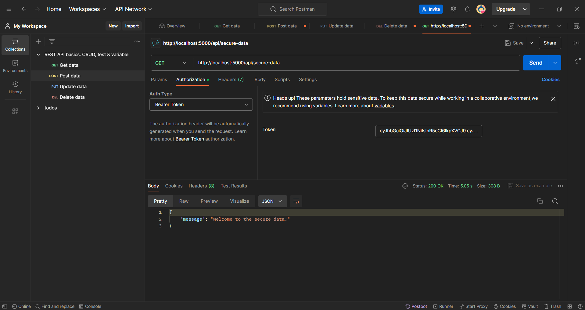

# JWT and Docker Kubernetes Project 

This project demonstrates a robust authentication system using JSON Web Tokens (JWT)  and containerization with Docker and deployment on a Kubernetes cluster ⎈ for a scalable and secure application architecture.

## Tools

- Node.js and npm
- Docker 
- Kubernetes cluster (minikube, local cluster) ☸️

## Project Overview

- **Secure Authentication:** Implement JWT-based authentication to protect your API endpoints with confidence.
- **Dockerized Deployment:** Package your application as a Docker image for consistent and portable deployments across environments ➡️.
- **Kubernetes Orchestration:** Leverage Kubernetes to manage containerized applications across a cluster, ensuring scalability and fault tolerance for high availability.

## Screenshots

JSON Web Token Authentication successful on POSTMAN

Docker successful Build

Server started on Kubernetes cluster, deployment successful

Docker Image Run

Kubernetes cluster to manage the docker image

Docker Image deployment on the Kubernetes cluster

## JWT Authentication Flow

1. **User Login:** The user provides credentials (username and password) .
2. **Server-Side Validation:** The server validates the credentials (against a database) ️‍♀️.
3. **JWT Generation:** Upon successful validation, the server generates a JWT signed with a secret key.
4. **Client-Side Storage:** The JWT is sent back to the client and typically stored in local storage or a secure cookie.
5. **Authorization:** Subsequent requests from the client include the JWT in an authorization header (`Bearer <token>`).
6. **Server-Side Verification:** The server verifies the JWT's signature and validity before granting access to protected resources.

Thanks and stay tuned for more!
